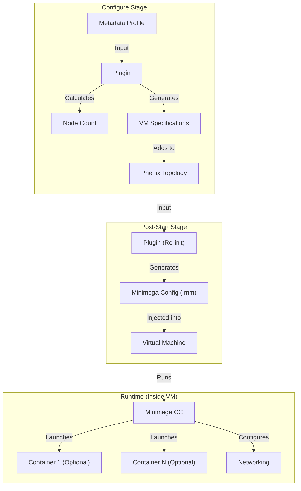

# Phenix Scale App

The **Scale App** is a specialized Phenix application designed for high-volume simulations. Unlike standard apps that map one host in the topology to one configuration, the Scale app uses **Plugins** to algorithmically generate large-scale topologies (hundreds or thousands of nodes) from concise metadata profiles.

The app is designed to be used in two ways:
1.  **Nested Containers (Primary)**: Running multiple containers inside VMs that have Minimega installed within them. This allows for high-density simulations where a single VM hosts many lightweight containers.
2.  **VM Scaling**: Simply deploying a large number of VMs by themselves without nested containers. This mode is illustrated by the `builtin` plugin, which can scale standard VMs based on a count.

## Architecture

The Scale app operates on a **Plugin Architecture**. The core app handles the generic Phenix lifecycle, directory management, and Minimega interaction. It delegates the specific logic of *what* to build (VM specs, IP addresses, internal configurations) to registered plugins.



### Lifecycle Stages

Because Phenix orchestrators run lifecycle stages as separate process executions, the plugin lifecycle is split into two distinct phases.

#### 1. Configure Stage (`phenix-app-scale configure`)
This stage defines the experiment topology (VMs, networks, injections).
*   Validates profiles.
*   Calculates node counts.
*   Generates VM specifications (CPU, RAM, Image).
*   Adds nodes to the Phenix topology.

#### 2. Post-Start Stage (`phenix-app-scale post-start`)
This stage runs after VMs are active. It generates runtime configurations (Minimega files).
*   Generates Minimega (`.mm`) configuration files for each node.
*   Injects runtime configurations into VMs.
*   Configures networking (IPs, Routes) inside the VMs via Minimega Command and Control (CC).

## Usage

The Scale app is typically invoked by the Phenix orchestrator based on the scenario metadata.

### Input Metadata Structure

The app expects a `profiles` list in its metadata. Each profile defines a set of resources managed by a specific plugin.

```yaml
spec:
  scenario:
    apps:
      - name: scale
        metadata:
          profiles:
            - name: my-cluster
              plugin: builtin
              containers: 50
              containers_per_node: 5
              node_template:
                image: ubuntu.qc2
                cpu: 2
                memory: 2048
              container_template:
                cpu: 1
                memory: 512
                rootfs: otsimfs.tgz
                gateway: MGMT
                networks:
                  - name: MGMT
                    network: 172.16.0.0/24
```

### Common Configuration Fields

| Field | Description |
| :--- | :--- |
| `name` | Unique identifier for the profile. |
| `plugin` | Name of the plugin to use (e.g., `builtin`, `wind_turbine`). Can be a string or a dict `{name: "...", version: "..."}`. |
| `count` | (Optional) Primary scaling factor. Meaning depends on the plugin (e.g., number of VMs or number of assets). |
| `containers` | (Optional) Total number of containers to deploy. Used by `builtin` plugin. |
| `containers_per_node` | (Optional) Density of containers per VM. |
| `node_template` | Overrides for VM hardware (`cpu`, `memory`, `image`, `network`). |
| `container_template` | Configuration for the workload inside the VM (e.g., `cpu`, `memory`, `rootfs`, `networks`, `gateway`). |
| `start_scripts` | List of local file paths to inject and run at startup on every node. |

### Plugin-Specific Semantics

While the Scale app provides a common schema, plugins are free to interpret these fields according to their domain logic.

**Example: The `count` field**
*   **`builtin` Plugin**: `count` refers to the number of **Virtual Machines** to deploy.
*   **`wind_turbine` Plugin**: `count` refers to the number of **Wind Turbines** (assets) to simulate. Since one turbine consists of 6 containers, the plugin calculates the actual number of VMs based on `containers_per_node`.

## Plugins

### Builtin Plugin (`builtin`)
The default plugin for generic infrastructure scaling.

**Modes:**
1.  **VM Scaling**: Set `count`. Creates `count` number of VMs.
2.  **Container Scaling**: Set `containers` and `containers_per_node`. Calculates required VMs to host the containers.

**Example:**
```yaml
- name: web-servers
  plugin: builtin
  containers: 100
  containers_per_node: 10
  # Result: 10 VMs created
```

### Wind Turbine Plugin (`wind_turbine`)
A domain-specific plugin for simulating wind farms.

*   **`count`**: Number of Wind Turbines (not VMs).
*   **`containers_per_node`**: Number of containers per VM.
*   **Logic**: Each turbine consists of 6 containers.
    *   Total Containers = `count` * 6.
    *   Total VMs = `Total Containers` / `containers_per_node`.

**Example:**
```yaml
- name: wind-farm
  plugin: wind_turbine
  count: 30                # 30 Turbines (180 containers)
  containers_per_node: 18  # 3 Turbines per VM
  # Result: 10 VMs created
```

## Developing Plugins

### Plugin Interface & Lifecycle

Plugins implement the `ScalePlugin` interface. The Scale app calls these methods at specific points in its lifecycle.

#### Configure Stage (`phenix-app-scale configure`)

1.  **`validate_profile(app, profile)`**: Called first to validate the user's profile configuration.
2.  **`pre_configure(app, profile)`**: Called to initialize the plugin with the profile data.
3.  **`get_node_count()`**: Called to determine how many VMs to create.
4.  **Loop over nodes (1 to count):**
    *   **`get_node_spec(index)`**: Returns the VM specification (hardware, network) for the node.
    *   **`get_hostname(index)`**: Returns the hostname for the node.
    *   **`get_additional_startup_commands(index, hostname)`**: Returns bash commands to run on VM startup (before Minimega).
    *   **`on_node_configured(app, index, hostname)`**: Called after the node is added to the topology. Useful for generating side-car configs or injections.

#### Post-Start Stage (`phenix-app-scale post-start`)

1.  **`pre_post_start(app, profile)`**: Called to re-initialize the plugin state (since this is a new process execution).
2.  **`get_node_count()`**: Called again to iterate nodes.
3.  **Loop over nodes (1 to count):**
    *   **`get_hostname(index)`**: Resolves hostname.
    *   **`get_container_count(index)`**: Returns the number of containers to launch on this VM.
    *   **`update_template_config(cfg)`**: Allows the plugin to inject custom variables into the Minimega template context.
    *   **`get_template_name()`**: Returns the name of the Minimega template to use (default: `minimega.mako`).

#### Overrideable Methods

| Method | Description | Required |
| :--- | :--- | :--- |
| `validate_profile` | Validates profile fields. Default checks for `name` and `plugin`. | No |
| `pre_configure` | Setup plugin state from profile. | Yes |
| `get_node_count` | Returns total VMs to deploy. | Yes |
| `get_node_spec` | Returns dictionary defining VM hardware/network. | Yes |
| `get_hostname` | Returns hostname string for node index. | Yes |
| `on_node_configured` | Hook for post-topology actions (e.g., injections). | Yes |
| `get_additional_startup_commands` | Bash commands to run in VM boot script. | Yes |
| `pre_post_start` | Re-setup plugin state for post-start phase. | Yes |
| `get_container_count` | Returns container count for a specific VM index. | Yes |
| `get_template_name` | Returns Mako template filename. Default: `minimega.mako`. | No |
| `update_template_config` | Modifies the dictionary passed to the Mako template. | No |
| `get_plugin_config` | Returns dict for debug logging. | No |

### Template Customization

Plugins can override the default Minimega template (`minimega.mako`) to customize how VMs and containers are launched.

1.  **Define `templates_dir`**: In your plugin's `__init__`, set `self.templates_dir` to the absolute path of your templates directory.
2.  **Override `get_template_name`**: Return the filename of your custom Mako template.
3.  **Override `update_template_config`**: Inject custom variables into the `config` dictionary passed to the template.

**Example:**
```python
class MyPlugin(ScalePlugin):
    def __init__(self):
        # Set templates directory relative to this file
        self.templates_dir = os.path.join(os.path.dirname(__file__), "templates")

    def get_template_name(self) -> str:
        return "my_custom_vm.mako"

    def update_template_config(self, cfg: dict[str, Any]) -> None:
        # Add custom variables for the template
        cfg["MY_CUSTOM_VAR"] = "some_value"
```

Plugins can be **Internal** (built into `phenix-apps`) or **External** (installed via separate Python packages).

### Internal Plugins
1.  Create a class inheriting from `phenix_apps.apps.scale.interface.ScalePlugin`.
2.  Implement the abstract methods.
3.  Decorate with `@register_plugin("my_plugin_name")`.
4.  Place the file in `phenix_apps/apps/scale/plugins/`.

### External Plugins
External plugins allow you to extend the Scale app without modifying the core codebase.

1.  **Create your plugin package** structure.
2.  **Implement the plugin** class with the `@register_plugin` decorator (same as 1-3 of **Internal Plugins**).
3.  **Register an entry point** in your `pyproject.toml` (or `setup.py`). The entry point name must start with `phenix-scale-plugin-`.

**Example `my_plugin.py`:**
```python
from phenix_apps.apps.scale.interface import ScalePlugin
from phenix_apps.apps.scale.registry import register_plugin

@register_plugin("my-external-plugin")
class MyExternalPlugin(ScalePlugin):
    # ... implement abstract methods ...
    pass
```

**Example `pyproject.toml`:**
```toml
[project.scripts]
# The name must start with 'phenix-scale-plugin-'
# The value points to the module containing the decorated class
phenix-scale-plugin-custom = "my_package.my_plugin:MyExternalPlugin"
```

See `phenix_apps/apps/scale/interface.py` for the API definition.

## Testing & Verification

### Unit Tests
The core logic and plugin loading mechanisms are tested in `phenix_apps/apps/scale/tests/test_scale.py`.

To run the tests:
```bash
pytest phenix_apps/apps/scale/tests/test_scale.py
```

### Dry-Run
You can execute a dry-run of the Scale app using the provided sample input `phenix_apps/apps/scale/tests/test_scale_input.yaml`. This verifies that the app can parse profiles and generate the expected topology without interacting with a live Phenix system.

You can also control the log verbosity by setting the `PHENIX_LOG_LEVEL` environment variable (e.g., `debug`, `info`, `warning`).

To prevent permission errors from writing to system log directories, file logging should be disabled by setting `PHENIX_LOG_FILE` to an empty string.

```bash
# Configure Stage (with debug logging)
PHENIX_LOG_FILE="" PHENIX_LOG_LEVEL=debug phenix-app-scale configure --dry-run < phenix_apps/apps/scale/tests/test_scale_input.yaml

# Post-Start Stage
PHENIX_LOG_FILE="" phenix-app-scale post-start --dry-run < phenix_apps/apps/scale/tests/test_scale_input.yaml
```