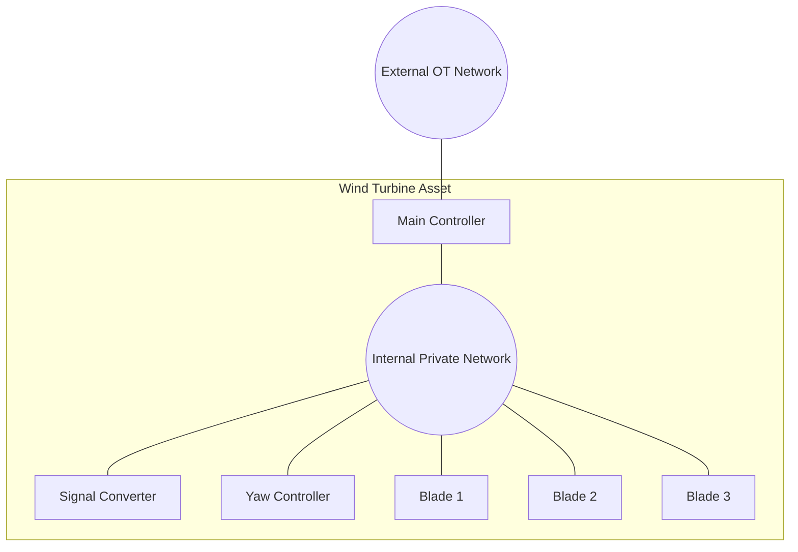

# Wind Turbine Scale Plugin

The **Wind Turbine Plugin** is a domain-specific plugin for the Scale App designed to simulate large-scale wind farms using the OT-Sim framework. It automates the complex topology generation required for high-fidelity wind turbine simulation.

## Architecture

Each "Wind Turbine" asset is composed of **6 distinct containers** connected by a private internal network:
1.  **Main Controller**: Runs control logic, DNP3 server, and Modbus client.
2.  **Signal Converter**: Simulates Anemometer (Wind Speed/Dir).
3.  **Yaw Controller**: Simulates nacelle rotation.
4.  **Blade 1, 2, 3**: Simulates blade pitch actuators.

The plugin packs these containers onto VMs based on the configured density.



## Configuration

### Core Fields

| Field | Type | Default | Description |
| :--- | :--- | :--- | :--- |
| `count` | Integer | `1` | The number of **Wind Turbines** to simulate (not VMs). |
| `containers_per_node` | Integer | `6` | The number of containers to run per VM. Since one turbine = 6 containers, set this to multiples of 6 (e.g., 18 for 3 turbines/VM). |
| `node_template` | Dict | `{}` | VM hardware specifications (CPU, RAM, Network). |
| `container_template` | Dict | `{}` | Configuration for the turbine containers (e.g. `external_network`, `cpu`, `memory`). |

### Metadata Sections

*   **`templates`**: Defines the OT-Sim configuration for the turbine components (logic, physics, protocols).
*   **`helics`**: Configures the HELICS co-simulation federation (Broker, Endpoint, Topic).
*   **`ground-truth-module`**: Configures Elasticsearch exfiltration for simulation data.

## Networking

The plugin manages two layers of networking:

1.  **Internal Network (Private)**:
    *   Used for communication between components of the same turbine (Modbus).
    *   Uses static IPs (e.g., `10.135.1.x`) reused across all turbines (isolated by VLANs).

2.  **External Network (OT)**:
    *   Used for SCADA communication (DNP3) and HELICS.
    *   Only the **Main Controller** is connected to this network.
    *   IPs are assigned sequentially based on the `external_network` CIDR.

## Implementation Details

### Template Override

The Wind Turbine plugin overrides the default Scale app template to support its specific networking and volume mounting requirements.

*   **Template**: `templates/wind_turbine.mako` (relative to plugin source).
*   **Customization**:
    *   **Namespace**: Sets minimega namespace to `wind`.
    *   **Container Naming**: Uses `wtg-{turbine_num}-{component_type}` pattern.
    *   **Volumes**:
        *   Mounts the generated OT-sim configuration directory (`/scale/<hostname>/<i>/`) to `/etc/ot-sim/` inside the container.
        *   Mounts a shared weather data directory if replay data is configured.
    *   **Networking**: Configures multiple interfaces for the Main Controller (external + private) and single interfaces for other components (private).

## Example Profile

```yaml
- name: wind-farm
  plugin: wind_turbine
  count: 30                # 30 Turbines (180 Total Containers)
  containers_per_node: 18  # 3 Turbines per VM -> 10 VMs Total
  container_template:
    external_network:
      name: ot
      network: 192.168.100.0/24
      gateway: 192.168.100.254
  helics:
    federate: OpenDSS
    topic: "{{turbine_name}}.power"
```

## Generated Artifacts

For each node, the plugin generates:
1.  **Minimega Config**: Launches the containers and configures networking.
2.  **OT-Sim Configs**: XML files for every module (Logic, Modbus, DNP3) in every container.
3.  **Tarball**: A `wind-configs.tgz` file containing all XMLs, injected into the VM.
4.  **HELICS Annotations**: Instructions for the HELICS app to launch brokers if needed.

## Testing

### Unit Tests
The plugin logic is tested in `phenix_apps/apps/scale/tests/test_wind_turbine.py`. This covers configuration parsing, IP calculation, and container detail generation.

To run the tests:
```bash
pytest phenix_apps/apps/scale/tests/test_wind_turbine.py
```

### Dry-Run
A comprehensive example input is provided in `phenix_apps/apps/scale/tests/test_wind_turbine_input.yaml`. This file defines a scenario with 30 wind turbines.

To execute a dry-run:
```bash
phenix-app-scale configure --dry-run < phenix_apps/apps/scale/tests/test_wind_turbine_input.yaml
```