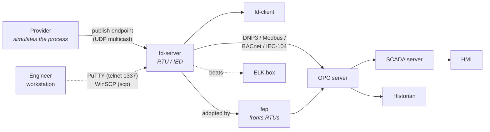
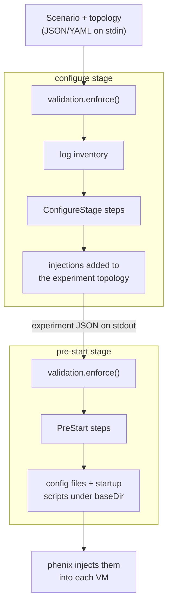
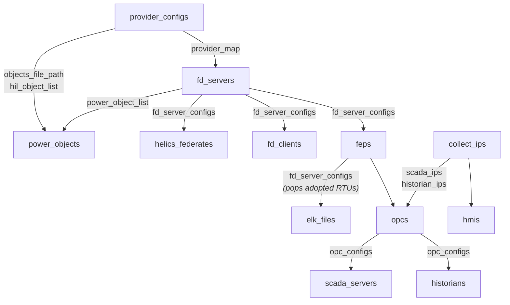

# Phenix SCEPTRE App

The **SCEPTRE app** builds industrial control system (ICS/SCADA) experiments. A
simulation *provider* (PowerWorld, PyPower, Simulink, RTDS, ...) models a
physical process; *field devices* expose that process over real industrial
protocols (DNP3, Modbus, BACnet, IEC 60870-5-104, SunSpec); and an *OPC server*,
*SCADA server*, *HMIs*, *engineer workstations* and a *historian* sit on top of
them the way they would in a real plant.

The app generates configuration: it reads each host's scenario metadata, renders
the config files and startup scripts that host needs, and tells phenix to inject
them into the VM.



## Lifecycle stages

Phenix runs each stage as a **separate process**, so nothing is carried in
memory between them. The app implements two.



`configure` only declares **what file goes where** — every injection, without
exception. The files do not exist yet; `pre-start` generates them. That split is
why a path can look correct in the topology and still be missing on the VM.

## Layout

A class per stage, and the pre-start clusters that share state get their own.

```
sceptre/
  app.py                    Sceptre: dispatch, shared helpers, logging
  stages.py                 Stage (what a handler needs from the app) and
                            PreStartState (what pre-start handlers share)
  configure.py              ConfigureStage: every injection declaration
  prestart.py               PreStart: step order, provider/helics/elk work
  field_devices.py          FieldDevices: fd-server, fd-client, fep
  scada.py                  Scada: opc, scada server, hmi, engineer, historian
  simulators.py             everything simulator-specific, one section each
  metadata.py               Simulator / Infrastructure names, metadata parser
  hosts.py                  topology questions both stages ask
  validation.py             pre-flight scenario checks: one pydantic model
  configs/
    infrastructures.yaml      the device-type table -- edit this, not the code
    infrastructures.py        loads it, and builds one device from it
    registers.py              Device and Register: fields -> wire addresses
    configs.py                FieldDeviceConfig, OpcConfig, HistorianConfig
  templates/                24 Mako templates
  tests/
```

`PreStart(FieldDevices, Scada, Stage)` composes the two clusters. Both inherit
`PreStartState`, so `self.fd_server_configs` resolves in their own MRO rather
than arriving from nowhere, and the state is declared in exactly one place.

> **Keep the `Sceptre` class in `app.py`.** `AppBase` resolves `templates_dir`
> from `sys.modules[self.__class__.__module__].__file__`, so the class must sit
> next to `templates/`. Moving it breaks every `render()` call at runtime with
> no import error.

The code is organized by stage, so `simulators.py` is the cross-cut: one
simulator's whole story — required metadata fields, configure injections,
config.ini kwargs — reads in one place. Its `INJECTIONS` table and family sets
are the dispatch; a simulator can sit in more than one family
(`PowerWorldHelics` is both a PowerWorld and a Helics). Matching goes through
`Simulator.parse()`, so it is case-insensitive, like validation. Adding a
simulator is an edit to that file: the hooks, plus rows in `REQUIRED_METADATA`,
`INJECTIONS` and the family sets.

## Hand-written overrides

Any injection declared with `override="<name>"` can be replaced by hand: drop a
file named `<hostname>_<name>` into `<assetDir>/injects/override/` and it is
injected instead of the generated one — `opc-1_opc.xml` replaces opc-1's
generated `opc.xml`. This is how a HIL setup points an OPC at real hardware
while the rest of the experiment stays generated, and it works without touching
the scenario. Only call sites that pass `override=` participate; the app logs
every override it applies, and warns about files in the directory that matched
nothing, since a typo'd hostname would otherwise silently fall back to the
generated file.

## The pre-start dependency chain

`ConfigureStage` methods may run in any order. **`PreStart` methods may not** —
they hand data to each other through the state on `PreStartState`, so the order
in `PreStart.steps()` is the dependency order.



Every method documents its half of that contract, and a new one should too —
it is the fastest way to see whether a reordering is safe:

```python
    Reads: provider_map
    Writes: fd_server_configs, fdlist, power_object_list, reg_config
```

## Device fields

`configs/infrastructures.yaml` says what each infrastructure's device types
expose — a power-transmission `bus` publishes seven analog-read fields, a
`shunt` one — and `create_device` turns a metadata entry into that device's
registers. A bad type is rejected there, and reported by validation first.

```yaml
power-transmission:
  range: [-600, 1800]
  devices:
    shunt:
      analog-read: [actual_mvar]
      binary-read: [active]
      binary-read-write: [active]
```

Adding a device type is an edit to that file — no code — then
`PHENIX_UPDATE_GOLDEN=1 pytest tests/test_infrastructures.py` to record it.

A device entry may override any of the four field lists:

```yaml
dnp3:
  - type: bus
    name: bus-1
    analog-read: [voltage]     # instead of the seven a bus exposes by default
```

Only `type`, `name` and those four keys are accepted; anything else is dropped
by the parser and reported as an unsupported key, since a typo there would
otherwise be a silent no-op.

## Validation

A broken scenario used to fail as a cryptic crash deep in pre-start or a silent
no-op. `validation.py` runs before either stage does any work, collects *every*
problem rather than stopping at the first, and names the host and field:

```
sceptre scenario check: 2 errors and 1 warning

ERRORS (the experiment cannot be built):
  rtu-1  metadata.provider 'provider-pww' matches no provider host
         -> did you mean 'provider-pw'?
  rtu-2  metadata.infrastructure is required on fd-server hosts

WARNINGS (accepted, but probably not intended):
  opc-1  metadata.connected_rtus references 'rtu-nope', which is not a known fd-server
         -> did you mean 'rtu-3'?
```

It is **one pydantic model**: a `Host` per scenario entry, whose `metadata` is a
discriminated union picked by `metadata.type`. The model is the schema — what
each device type may carry, and which of it is required.

Two channels, because pydantic has no notion of a warning. Malformed input
(wrong type, missing field, extra device key) raises, and `_malformed()` renders
those errors in the app's own wording; everything else — references, interfaces,
simulator inputs — is appended by a model's `check()`, which never raises. That
is what makes one run report the whole backlog.

The two severities are a **compatibility rule**:

| | meaning | when to use |
| --- | --- | --- |
| `fatal=True` | the experiment cannot be built | only when the condition *provably crashes* the current code |
| `fatal=False` | built anyway, but probably a mistake | typo'd references, a device with no protocols |

So nothing that previously built is now rejected.
`test_clean_scenario_has_no_problems` guards the other side: the golden fixture
must come through clean.

`enforce()` logs the report, then raises `error.AppError` for
`AppBase.execute_stage` to log and exit on — the 2.0.0 app contract. The report
is its own record; the exception message only carries the count.

## Logging

A run reports what it found and what each step produced:

```
sceptre configure: 21 hosts -- provider=3 fd-server=3 fd-client=1 fep=1 opc=2
  scada-server=2 hmi=2 engineer-workstation=1 historian=3 elk=1 ...
  opc                    +8 injections
  field devices          +10 injections
  historian              +12 injections
  ...
sceptre configure: 69 injections added
```

The inventory is the quickest way to spot a host left out or given the wrong
`metadata.type` — the count you expected is not there. Absent types are omitted
rather than printed as zero.

`Sceptre._run_steps` does the accounting by diffing a count across each handler,
so **handlers contain no logging**; add none. Steps that produce nothing drop to
`DEBUG`.

## Developing

```bash
cd src/python
make install-dev

make test TEST=phenix_apps/apps/sceptre     # 128 tests
make check                                  # ruff + codespell + vulture
make dry-run APP=sceptre STAGE=configure \
  INPUT=phenix_apps/apps/sceptre/tests/test_sceptre_input.yaml
```

### Two golden tests are the safety net

`tests/test_infrastructures.py` snapshots **every** (infrastructure, device
type, protocol) combination, supported or not. The scenario fixture exercises 1
of the 10 infrastructures, so this is what makes a change to
`infrastructures.yaml` reviewable rather than blind.

`tests/test_sceptre_golden.py` runs both stages against
`tests/test_sceptre_input.yaml` and asserts the emitted experiment JSON and a
sha256 manifest of all 97 generated files are unchanged. It says nothing about
*correctness* — only that output has not moved.

When a change is intentional:

```bash
PHENIX_UPDATE_GOLDEN=1 pytest phenix_apps/apps/sceptre/tests/test_sceptre_golden.py
```

Review the diff before committing. A hash tells you *that* a file changed, not
*what*; for that, run the app twice with `--dry-run` into two directories and
`diff -r` them.

### Adding a host type

A *device type* is a `bus` or a `pump` inside an infrastructure, and lives in
the YAML above. This is the other thing: a new kind of **host**, like `opc` or
`historian`.

1. `ConfigureStage` — a method that adds the injections, one per file the VM
   needs. One `self.inject(host, src, dst, description)` call each; pass
   `override=` when the file may be replaced by hand.
2. A pre-start method, on `PreStart` or on whichever cluster shares its state.
   Document its `Reads:` / `Writes:` lines.
3. Add both to the `steps()` of their stage. For pre-start, position it by its
   state dependencies.
4. Add the type to `Sceptre.DEVICE_TYPES` so it appears in the inventory.
5. `validation.py` — a metadata model for the type, and a `check()` for
   whatever the handler dereferences directly. Fatal only if omitting it
   crashes.
6. Extend `tests/test_sceptre_input.yaml` and regenerate the golden file.

### Adding a validation check

A new field goes on that device type's metadata model; a new rule goes in its
`check()`, which appends a `Problem` and never raises. Add a row to the
parametrized table in `tests/test_validation.py`. For a fatal check, first
confirm the condition actually crashes without it — break the fixture and run
the app. That evidence is what makes the check safe to add.

### Testing helpers

Three levels; picking the right one is most of the work.

| level | use | what it proves |
| --- | --- | --- |
| `sceptre_app` | one method, hand-built hosts | the handler does the right thing with this input |
| `scenario` | the real app on the real fixture | the whole scenario still parses and validates |
| golden tests | both stages end to end | nothing anywhere changed the output |

**`mock_app`** (from the `phenix_apps.testing` plugin, auto-loaded via
`pytest11`; needs `@pytest.mark.app_class(cls=Sceptre)`) builds a Sceptre
*without running `__init__`* and replaces every public `AppBase` method with a
`MagicMock`. That is what makes a handler testable: `__init__` reads the
experiment from stdin, and the extract/add methods reach into a real topology.
Mocking them turns "what did the handler do?" into `add_inject.call_args_list`.

Two consequences:

- `__init__` is skipped, so its attributes are missing. **`sceptre_app`** is
  `mock_app` plus `startup_dir`, `sceptre_dir` and `elk_dir` under `tmp_path`.
- Only `AppBase` methods are mocked. `find_override` and `render_sceptre_start`
  are mocked by hand; `inject()` and `host_dir()` are left real, which is why the
  configure tests can assert on the dicts `inject()` builds. For the real
  `find_override`, call it unbound: `Sceptre.find_override(app, "opc-1_opc.xml")`.

**`scenario`** is the opposite — a real `Sceptre` parsed from the golden fixture,
optionally mutated first:

```python
app = scenario(lambda exp: host(exp, "rtu-1").metadata.pop("provider"))
```

Validation and inventory logging are cross-host questions, so a hand-built host
cannot exercise them. `conftest` ships the awkward mutations: `host()`,
`topo_node()`, `drop_topo_node()`, `only_mgmt_interface()`.

**`node()` / `iface()`** build the Box shape `extract_nodes_*` returns, so a
handler test states its input in three lines instead of twenty.

Two autouse fixtures work around global state: `caplog_loguru_sink` routes
loguru into stdlib logging so `caplog` sees anything at all, and
`_reset_register_addresses` resets `Register.addresses` around every test, since
a test that raises part-way through would otherwise leave the next one numbering
registers from wherever it stopped.

## Known issues

Pre-existing, and pinned by a test rather than silently carried.

| | issue |
| --- | --- |
| **`hil_tags` overwritten per provider** | With more than one PowerWorld provider only the last one's tags reach `objects.txt`. |
| **The ELK restart script points at one provider** | `sceptre_provider_restart.py` is rendered with the last provider's address, so the others cannot be restarted from ELK. Visible in the golden fixture, which has four providers. |
| **Inconsistent mgmt-vlan filtering** | The OPC/SCADA/historian code compares `vlan != "mgmt"` case-sensitively; the field device code lowercases first. `MGMT` is therefore excluded in one and not the other. Both now go through `hosts.non_mgmt(case_sensitive=...)`, so the split is visible at each call site and pinned by `test_hosts.py`. |
| **`Register.addresses` is global state** | Class-level mutable state reset per `FieldDeviceConfig`, so register numbering is order-dependent. Tests reset it via an autouse fixture. |
| **SunSpec register maps are unreachable** | `SunSpecDevice.Register.mappings` is keyed `PowerDistribution`/`PowerTransmission`, but a device carries the lowercase infrastructure name, so any inverter on the `sunspec` protocol raises `KeyError`. Pinned in `infrastructures_golden.txt`. |
| **`reg_config` is never populated** | Nothing in the app builds a manual register map, so the `reg_config` branch in `Register.__init__` is unreachable. Only `protocols/*` remains in the ruff per-file-ignores; everything else in the app is fully linted. |
